<b>Howdy, my name is Guilherme!</b> 👋
  

 •  🔭 Currently working at NTL as Apprentice Fullstack Developer  
 •  👨‍💼 Founder and Lead Developer at <a href="https://github.com/Rede-Ender">Rede Ender</a>   
 • 🌱 Student of System Analysis and Development at UERJ

##

 
 

  
  
    
    
    
    
    
    
    
  

  
  ##
  
  

     
   <em>Hey, chin up. I know the night just got darker, but it won't last forever</em>
  

  
  ##
  
  

  

##
  
  
 
  
  
   
 

  

