<b>Howdy, my name is Guilherme!</b> 👋
  

 •  🔭 Currently working at NTL as Apprentice Fullstack Developer  
 • 🌱 Student of System Analysis and Development at UERJ

##

 
 

  
  
    
    
    
    
    
  

  
  ##
  
  
 
  
  
   
 

  

